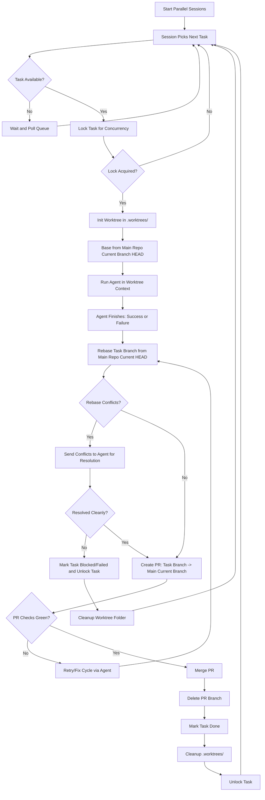

# 15 - Git Worktree Task Lifecycle

## Assumptions

- Task list is fully populated.
- Execution is parallel (multiple sessions/workers in flight).
- Main repository branch is the current working branch and is the PR target branch.
- Worktrees are created under `.worktrees/` in the main repository root.

## Lifecycle Summary

1. Start parallel sessions.
2. For each session, fetch the next available task.
3. Acquire a concurrency lock on that task.
4. Initialize a task worktree in `.worktrees/` from current main repository branch HEAD.
5. Run agent in that worktree context.
6. On agent completion (success or failure), rebase from main repository current HEAD again.
7. If conflicts occur, route conflict resolution to the agent.
8. Create PR from task branch to main repository current branch.
9. If PR checks are green, merge and delete PR branch.
10. Mark task done, clean up `.worktrees/` task folder.
11. Repeat for next task.

## Mermaid Flowchart

## Locking and Concurrency Notes

- Lock key should be task-scoped (e.g., `task:<task-id>`).
- Lock acquisition must be atomic and have a TTL/heartbeat to avoid orphan locks.
- Unlock should happen on every terminal path (success, blocked, failed, cancelled).

## Worktree Initialization Rules

- Worktree path format: `.worktrees/<task-id>-<slug>`.
- Branch naming format: `task/<task-id>-<slug>`.
- Base commit is always current HEAD of the main repository active branch at task start.
- At worktree start, create/attach dedicated thread log file: `<worktree-name>.log`.
- Per-worktree thread log must be separate from primary application log stream.

## Drift Minimization Rules

- Always perform a rebase against current main repo branch HEAD after agent completion.
- Conflict resolution is agent-assisted first; if unresolved, task is not merged.

## PR and Completion Rules

- PR target must be the main repository current branch.
- Merge only when required checks pass.
- After successful merge: delete branch, mark task done, and remove worktree folder.
- On non-merge terminal path: keep diagnostic artifacts and mark status appropriately.
- Worktree log file must remain available for audit/diagnostics per retention policy even after thread completion.

## Failure and Resume Rules

- If agent/workflow fails mid-task, preserve task branch + worktree by default.
- Resume processing from last durable checkpoint in same worktree context where possible.
- Do not clean up `.worktrees/<task-id>` for recoverable failures.
- Cleanup/discard of partial worktree is allowed only for explicitly classified extreme/terminal failure cases.
